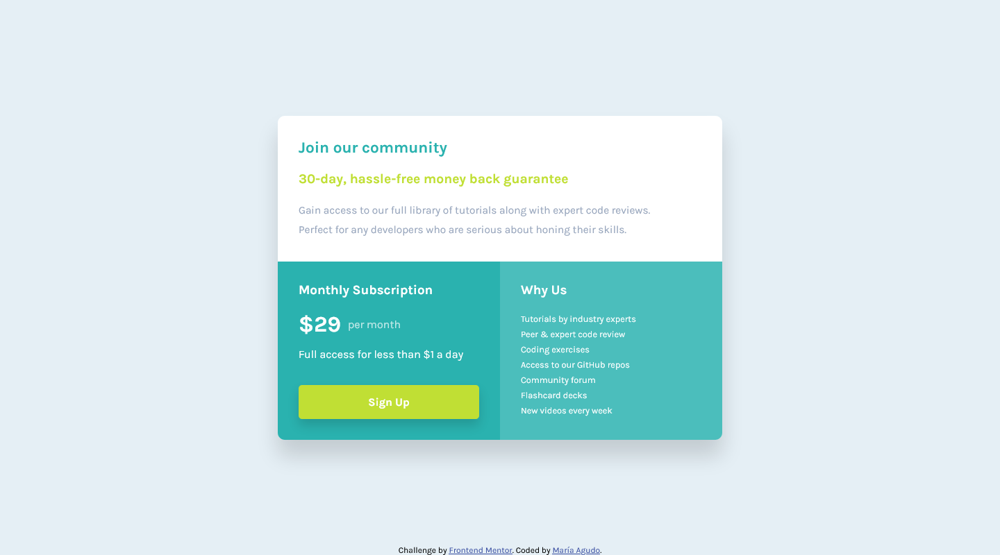

# Frontend Mentor - Single price grid component solution

This is a solution to the [Single price grid component challenge on Frontend Mentor](https://www.frontendmentor.io/challenges/single-price-grid-component-5ce41129d0ff452fec5abbbc). Frontend Mentor challenges help you improve your coding skills by building realistic projects. 

## Table of contents

  - [The challenge](#the-challenge)
  - [Screenshot](#screenshot)
  - [My process](#my-process)
  - [Built with](#built-with)
  - [What I learned](#what-i-learned)
  - [Continued development](#continued-development)
  - [Useful resources](#useful-resources)
  - [Author](#author)

### The challenge

Users should be able to:

- View the optimal layout for the component depending on their device's screen size
- See a hover state on desktop for the Sign Up call-to-action

### Screenshot

## My process

This is my first challenge using Mobile First Design and rem units in everything, so yeah.

### Built with

- Semantic HTML5 markup
- CSS custom properties
- Flexbox
- CSS Grid
- Mobile-first workflow

### What I learned

I think I learned the MOST in this challenge. I thought: Hmm, this looks simple, let's LEARN about Mobile First design with this one. Then, I realized the issues when I zoom in my pages, and that lead me to investigate about rem units and actually apply them to all my design. 

### Continued development

I NEED to keep learning how to use rem units in everything and if that makes my pages responsive. When I started these challenges, I had issues when I zoom in the pages, there was overflow in everything. I've been looking other people's codes and I realized they use rem units. I don't even know how to use them, but now I feel like I need to use them in order to achieve that goal of building a responsive page.

### Useful resources

- [Sitepoint](https://www.sitepoint.com/understanding-and-using-rem-units-in-css/) - This article helped me understand rem units and it guide me in this design.
- [W3Schools](https://www.w3schools.com) - This time I checked this for transitions!

## Author

- Github - [María Agudo](https://github.com/mdagudo/)
- Frontend Mentor - [@mdagudo](https://www.frontendmentor.io/profile/mdagudo)

